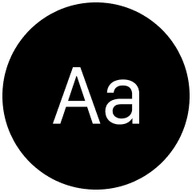

  <a href="https://fonts.taedonn.com">
      
      <h1 align="center">Fonts Archive</h1>
  </a>
  

    
    
    
  

&nbsp;

## 라이브 서버

웹사이트 방문하기 : https://fonts.taedonn.com

&nbsp;

## 깃허브 프로젝트

깃허브 프로젝트 방문하기 : https://github.com/fonts-archive

&nbsp;

## 개발 목적

폰트 아카이브는 상업용 무료 한글 폰트를 아카이빙하기위해 제작한 웹사이트입니다. 이 프로젝트는 한글 폰트를 아카이빙한 웹사이트 중 Google Fonts처럼 웹 임베딩에 최적화된 서비스가 없다는 생각이 들어서, 웹 임베딩에 최적화된 서비스 개발을 목적으로 시작한 프로젝트입니다. 이 프로젝트에 저장된 모든 폰트들은 상업적/개인적 목적으로 사용이 허가된 폰트들이지만, 폰트 별 사용 범위는 폰트 제작사의 규정에 따라 다를 수 있기 때문에, 따로 라이센스 허가 범위를 표기한 테이블과 라이센스 본문을 폰트별로 기재해 놓았습니다.

&nbsp;
